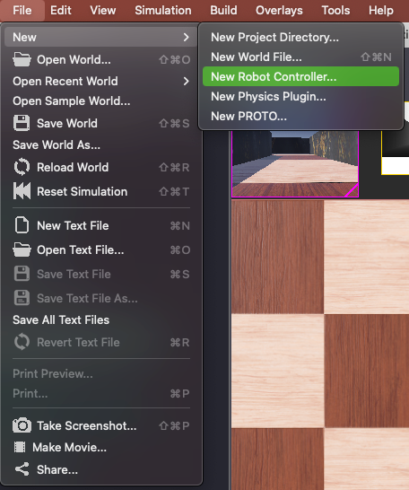
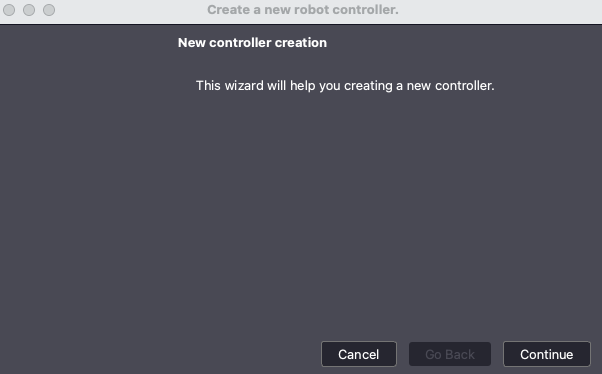
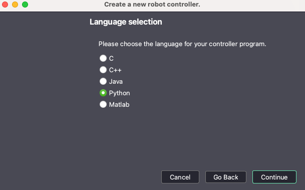
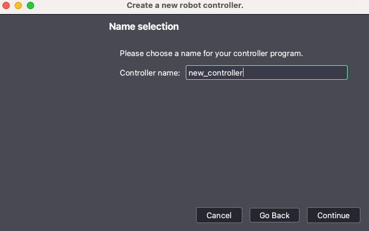
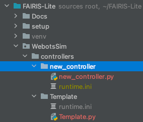
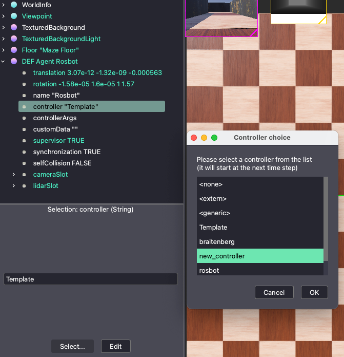

# Webot Robot Controllers
FAIRIS-Lite uses python scripts that will be utilized by Webots to control the simulated robot. You can find more 
details in [Webots Documentation](https://cyberbotics.com/doc/guide/controller-programming?tab-language=python). 
FAIRIS-Lite provides a template and libraries that stream lines the development of robot controller, however you 
will still need to create new controllers. Below are the steps you will need to follow inorder to create a new Robot 
Controller.

### Requirements
This guide assumes that you have already preformed the [FAIRIS-Lite Setup](../../README.md) instructions.

## How to create a new Webots Robot Controller
1. Launch WebotsR2023b and open the world file located in ```FAIRIS-Lite/WebotsSim/worlds/StartingWorld.wbt```
2. Within the Webots GUI select: ```File -> New -> New Robot Controller...```

3. 

4. This will launch a new controller creation wizard select ```Continue```



6. You will need to select ```Python``` as the language for your new controller program



8. Next you will provide a name for the new controller



6. You will need to confirm the creation of a new directory and Python file. Note that you may be asked to allow 
   Webots access to the directory in which the files are being created.
7. Once the new controller is created you will need to copy the file located in 
   ```FAIRIS-Lite/WebotsSim/controllers/Template/runtime.ini``` into the directory just created.



10. We recomend that you include the following lines in your new Python controller.
```python
# Changes Working Directory to be at the root of FAIRIS-Lite
import os
os.chdir("../..")

# Import MyRobot Class
from WebotsSim.libraries.MyRobot import MyRobot

# Create the robot instance.
robot = MyRobot()

# Loads the environment from the maze file
maze_file = 'path/to/maze/file.xml'
robot.load_environment(maze_file)

# Move robot to a random staring position listed in maze file
robot.move_to_start()
```

## How to select new controller for robot to use
1. Launch WebotsR2023b and open the world file located in ```FAIRIS-Lite/WebotsSim/worlds/StartingWorld.wbt```
2. On the left panel expand ```DEF Agent Rosbot```
3. Under ```DEF Agent Rosbot``` select the controller "current_controller" argument
4. Towards the bottom of the left panel, click the ```Select...``` button
5. A window will pop up with a list of all controllers available for FAIRS-Lite, select your desired controller and 
   click ```OK``` button



