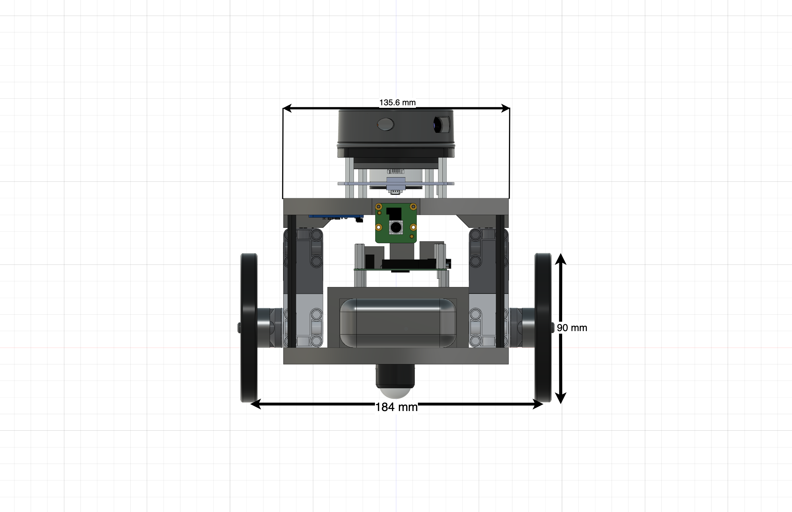

# HamBot

### HamBot Support in FAIRIS-Lite

FAIRIS-Lite supports integration with the **[HamBot](https://github.com/biorobaw/HamBot)**, an open-source differential drive robot developed by [CJHRobotics](https://github.com/biorobaw/HamBot). The HamBot features:

- Two high-torque [LEGO Technic Large Motors](https://le-www-live-s.legocdn.com/sc/media/files/support/spike-prime/techspecs_techniclargeangularmotor-1b79e2f4fbb292aaf40c97fec0c31fff.pdf)
- A [LEGO Build HAT](https://www.raspberrypi.com/products/build-hat/) for motor control and power management
- A [BNO055 IMU](https://learn.adafruit.com/adafruit-bno055-absolute-orientation-sensor/python-circuitpython) for orientation and motion sensing
- A [Slamtec RPLidar A1](https://learn.adafruit.com/slamtec-rplidar-on-pi) for 360° range measurements
- Full Python programmability for rapid prototyping and control

Designed specifically for research and education in **SLAM (Simultaneous Localization and Mapping)**, the HamBot provides a robust platform for developing and testing robotic algorithms.

A detailed 3D model of the HamBot is also available and fully supported in the **[Webots](https://cyberbotics.com/)** simulator, enabling seamless transition between simulation and hardware.


## HamBot Features



| Characteristic                         | Value         |
|---------------------------------------|---------------|
| Length                                | 200 mm        |
| Width                                 | 184 mm        |
| Wheel Diameter / Radius               | 90 mm / 45 mm |
| Axel Width                            | 184 mm        |
| Height                                | 220 mm        |
| Weight                                | 1.65 kg       |
| Max forward/reverse wheel speed       | 0.81 m/s      |
| Max forward/reverse motor speed       | 18 rad/s      |

The HamBot uses [LEGO Technic Large Motors](https://le-www-live-s.legocdn.com/sc/media/files/support/spike-prime/techspecs_techniclargeangularmotor-1b79e2f4fbb292aaf40c97fec0c31fff.pdf) interfaced via the [LEGO Build HAT](https://www.raspberrypi.com/products/build-hat/), with sensing powered by the [BNO055 IMU](https://learn.adafruit.com/adafruit-bno055-absolute-orientation-sensor/python-circuitpython) and the [Slamtec RPLidar A1](https://learn.adafruit.com/slamtec-rplidar-on-pi)). A camera is included for landmark-based navigation tasks. The entire system is programmable in Python.

---

## HamBot Class (Webots Simulation)

The FAIRIS-Lite framework includes a `HamBot` Python class that emulates the real robot inside Webots. It is based on the `Supervisor` class and provides a high-level interface for controlling robot motion, reading sensors, loading environments, and visualizing results.

### Class Overview

```python
from controller import Supervisor
from fairis_lib.mapping_utils.environment import Maze
import matplotlib.pyplot as plt
import math
```

```python
class HamBot(Supervisor):
    ...
```

---

### Core Attributes

| Attribute | Description |
|----------|-------------|
| `self.experiment_supervisor` | Interface with the Webots Supervisor API |
| `self.display`               | Image display to visualize place cell activations |
| `self.left_motor`, `self.right_motor` | Rotational motors |
| `self.left_encoder`, `self.right_encoder` | Position sensors for the wheels |
| `self.camera`, `self.lidar`, `self.imu`, `self.gps` | Webots sensor interfaces |
| `self.wheel_radius`, `self.axel_length` | Physical specifications |
| `self.timestep`              | Control loop interval |

---

### Main Methods

- `sensor_calibration()` – Performs a single simulation step to update all sensor values.
- `get_encoder_readings()` – Returns `[left, right]` encoder values in radians.
- `get_compass_reading()` – Reads the IMU heading in degrees from East (0–360°).
- `get_lidar_range_image()` – Returns the 360° LiDAR scan as a list.
- `set_left_motor_velocity()` / `set_right_motor_velocity()` – Control motor speeds with automatic velocity capping.
- `stop()` / `go_forward()` – Basic motion primitives.
- `teleport_robot(x, y, z, theta)` – Instantly reposition the robot in simulation.
- `load_environment(maze_file)` – Load XML-based mazes with obstacles, walls, and landmarks.
- `move_to_start()` – Randomly position the robot at one of the valid start locations.
- `update_display(fig)` – Pushes a Matplotlib figure to the Webots display.

---

### Usage Example

```python
# Import MyRobot Class
from fairis_tools.my_robot import MyRobot
# Create the robot instance.
robot = MyRobot()

# Loads the environment from the maze file
maze_file = '../../worlds/Spring25/maze1.xml'
robot.load_environment(maze_file)

# Move robot to a random staring position listed in maze file
robot.move_to_start()

# Main Control Loop for Robot
while robot.experiment_supervisor.step(robot.timestep) != -1:

   print("Max rotational motor velocity: ", robot.max_motor_velocity)


    # Reads and Prints Robot's Encoder Readings
    print("Motor Encoder Readings: ", robot.get_encoder_readings())

    # Reads and Prints Robot's Lidar Readings Relative to Robot's Position
    print("Lidar Front Reading", robot.get_lidar_range_image()[180])
    print("Lidar Left Reading", robot.get_lidar_range_image()[90])
    print("Lidar Rear Reading", robot.get_lidar_range_image()[0])
    print("Lidar Right Reading", robot.get_lidar_range_image()[270])
    print("Simulation Time", robot.experiment_supervisor.getTime())

    # Sets the robot's motor velocity to 18 rad/sec
    robot.set_right_motor_velocity(18)
    robot.set_left_motor_velocity(18)

    # Calculates distance the wheel has turned since beginning of simulation
    distance_left_wheel_traveled = robot.wheel_radius * robot.get_left_motor_encoder_reading()
    robot.experiment_supervisor.getTime()

    # Stops the robot after the robot moves a distance of 1.5 meters
    if robot.experiment_supervisor.getTime() > 1.85:
        robot.stop()
        break


```

---

### Extending the Class

You may subclass `HamBot` to implement your own control logic or experiment routines. All sensor accessors and motor controls are designed for ease of use and educational clarity.

```python
class MyRobot(HamBot):
    def custom_behavior(self):
        self.go_forward(3)
        ...
```

For customization, extend from `HamBot` in your student or research code. This promotes modularity and reuse while keeping the FAIRIS-Lite core clean and maintainable.
